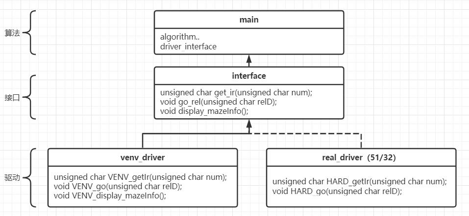
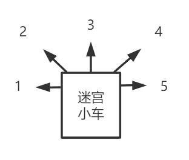
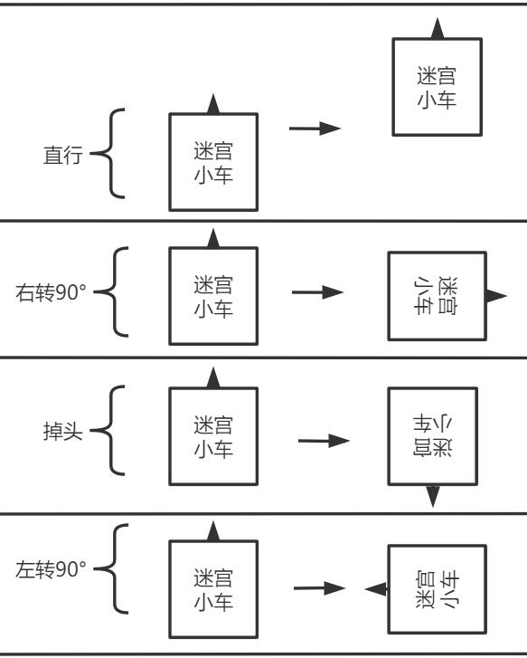
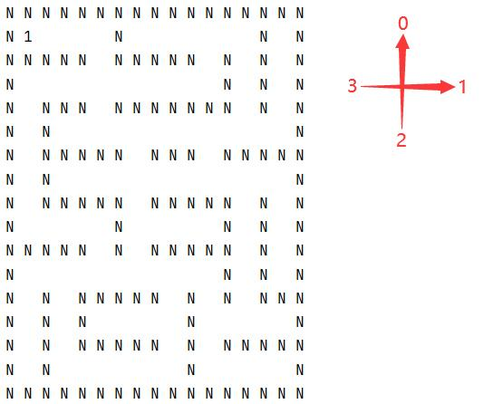

# maze_simulation_template
## 一、使用指南
- 1、新建工程（clion）
- 2、将以下文件移动并替换
  - lib：虚拟迷宫的静态链接库
  - interface.c：接口实现
  - interface.h：接口声明
  - main.c：demo主程序
- 3、修改CMakeLists.txt
```c
cmake_minimum_required(VERSION 3.17)
project(你的项目名 C)

set(CMAKE_C_STANDARD 99)

link_directories(lib)
add_executable(${PROJECT_NAME} main.c interface.c interface.h)
target_link_libraries(${PROJECT_NAME} libvenv_driver.a)
```
- 4、运行
## 二、工程结构

## 三、接口说明
- **unsigned char get_ir(unsigned char num);**
    - Description：获取某编号的红外传感器数值
    - Params：红外传感器编号[1, 5]
    - Return：有墙1，无墙0  
    
- **void go_rel(unsigned char relD);**
    - Description：使小车产生某种动作
    - Params：动作编号[0, 3]，直行0，右转90°1，掉头2，左转90°3
    - Return：void  
    
- **void display_mazeInfo();**
    - Description：输出当前迷宫状态
    - Params：void
    - Return：void  
    